

# Parciales Inge 3

---

- [Primera Fecha 2025](#primera-fecha-2025)
  - [1) Administración de Proyectos](#1-administración-de-proyectos)
  - [2) Calidad de Software](#2-calidad-de-software)
  - [3. Auditoría de Sistemas](#3-auditoría-de-sistemas)
  - [4. Interfaces No Tradicionales](#4-interfaces-no-tradicionales)
- [Primera Fecha 2023](#primera-fecha-2023)
    - [1) Administración de Proyectos](#1-administración-de-proyectos-1)
    - [2. Calidad de Software](#2-calidad-de-software-1)
    - [3. Auditoría de Sistemas](#3-auditoría-de-sistemas-1)
- [Segunda Fecha 2022](#segunda-fecha-2022)
  - [1) Administración de Proyectos](#1-administración-de-proyectos-2)
  - [2. Calidad de Software](#2-calidad-de-software-2)
  - [3. Auditoria de Sistemas](#3-auditoria-de-sistemas)
  - [4. Sistemas Colaborativos](#4-sistemas-colaborativos)

  

---
# Primera Fecha 2025

## **1) Administración de Proyectos**

**A) Explique el concepto de “Triángulo de alcance” y la relación que existe entre todos los parámetros involucrados.**

Respuesta

El “Triángulo de Alcance” es una representación visual que ilustra la interdependencia entre los parámetros de un proyecto. Muestra la relación intrínseca entre el Alcance y la Calidad del Proyecto con el Costo, Recursos y Tiempo del mismo.

Cualquier modificación que se realice en alguno de los vértices de este triángulo generará eventualmente una deformación en los otros 2 vértices.

Este demuestra de forma gráfica la interdependencia entre los parámetros involucrados. 

**¿Y el cuadro?**

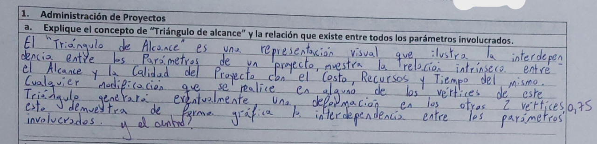

ChatGPT

El **Triángulo de Alcance** representa las tres restricciones clave de un proyecto: **alcance y calidad**, **tiempo** y **costo**, influenciadas por los **recursos** disponibles. Estos elementos están interrelacionados: un cambio en uno impacta a los demás. Por ejemplo, aumentar el alcance implica más tiempo o más costo. El objetivo del líder del proyecto es mantenerlos en equilibrio para asegurar el éxito del proyecto.

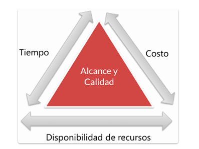

---

**B) Indique cuáles de los siguientes son enfoques de la gestión de los stakeholders. (Verdadero o Falso)**

Imagen Parcial (No mirar)

Estrategia de gestión de los stakeholders

VERDADERO

Es un enfoque clave que define cómo se abordará la relación con cada stakeholder según su poder, interés e influencia. Permite diseñar acciones específicas para gestionar sus expectativas y participación en el proyecto.

Matriz de impacto

VERDADERO

Esta herramienta ayuda a evaluar el nivel de impacto que tiene cada stakeholder sobre el proyecto y viceversa. Facilita priorizar a quién prestar más atención y con qué estrategia actuar (por ejemplo: informar, involucrar, monitorear).

Mantener el interés y el compromiso de los stakeholders

VERDADERO

Es un objetivo central en la gestión de stakeholders. La participación activa de los interesados aumenta las probabilidades de éxito del proyecto. Mantener su compromiso requiere planificación, comunicación y seguimiento continuo.

Mapa de los stakeholders

VERDADERO

Es una representación visual que clasifica a los stakeholders según su poder e interés, ayudando a tomar decisiones estratégicas sobre cómo gestionarlos. Es una de las herramientas más comunes en el análisis inicial.

Analizar los stakeholders

FALSO

Es incorrecto considerarlo un enfoque en sí mismo, aunque el análisis es una etapa previa a la gestión. Analizar implica identificar quiénes son, qué esperan y cómo pueden influir, pero no constituye un enfoque de gestión directamente, sino una actividad preparatoria.

Canales de comunicación

VERDADERO

Definir canales adecuados (reuniones, reportes, correos, etc.) es esencial para gestionar la relación con los stakeholders. La comunicación efectiva permite mantener informados a los interesados y atender sus necesidades.

---

**C) Indique de las siguientes cuáles son características de un programa y cuáles de un proyecto.**

Imagen Parcial (No mirar)

Tienen un amplio alcance que puede cambiar para satisfacer las expectativas:
**PROGRAMA**

Se realiza una planificación detallada para administrar la entrega de productos y servicios: 
**PROYECTO**

El estilo de liderazgo se centra en la gestión de las relaciones y la resolución de conflictos: 
**PROGRAMA**

El éxito se mide por el presupuesto, el tiempo de entrega y los productos que cumplen las especificaciones: 
**PROYECTO**

---

**D) Una empresa de seguros de vehículos cuenta con una planta de 50 empleados. En base a requerimientos de los directivos, se definió la ejecución de un proyecto para proveer un sistema de sueldos.**

Imagen Parcial (No mirar)

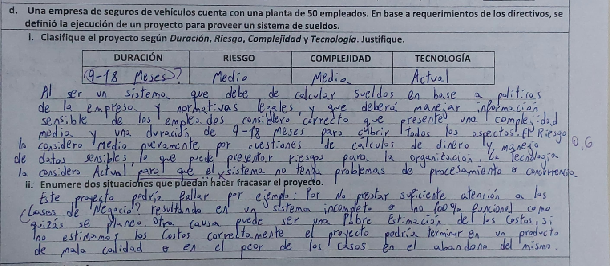

**i. Clasifique el proyecto según *Duración*, *Riesgo*, *Complejidad* y *Tecnología*. Justifique.**

| **DURACIÓN** | **RIESGO** | **COMPLEJIDAD** | **TECNOLOGÍA** |
| ------------ | ---------- | --------------- | -------------- |
| -            | -          | -               |   -            |

Respuesta

| **DURACIÓN** | **RIESGO** | **COMPLEJIDAD** | **TECNOLOGÍA** |
| ------------ | ---------- | --------------- | -------------- |
| 9–18 meses   | Medio      | Media           | Actual         |

Al ser un sistema que debe de calcular sueldos en base a políticas de la empresa y normativas legales y que deberá manejar información sensible de los empleados, considero correcto que presente una complejidad media y una duración de 9–18 meses para cubrir todos los aspectos. El riesgo lo considero medio nuevamente por cuestiones de cálculos de dinero y manejo de datos sensibles, lo que puede proyectar riesgos para la organización. La tecnología la considero actual para que el sistema no tenga problemas de procesamiento o concurrencia.

**ii. Enumere dos situaciones que puedan hacer fracasar el proyecto.**

Respuesta

Este proyecto podría fallar por ejemplo por no prestar suficiente atención a los Casos de Negocio, resultando en un sistema incompleto o no 100% funcional como quizás se planeó. Otra causa puede ser una pobre estimación de los costos, si no estimamos los costos correctamente el proyecto podría terminar en un producto de mala calidad o en el peor de los casos en el abandono del mismo.

---

## **2) Calidad de Software**

**A) Describa el concepto de “Calidad de Producto de Software”, mencione los modelos de calidad y formas de evaluación vistas en la materia.**

Respuesta

La Calidad de Producto de Software hace referencia a las características que debe tener el software para satisfacer los requerimientos funcionales y no funcionales, y las expectativas del usuario tanto de forma interna como externa. Este concepto hace análisis en el software en sí y no en el proceso que lo crea.

Los modelos de calidad más usados son los definidos en la **ISO/IEC 9126-1**, que luego sería reemplazada por **ISO/IEC 25010** con un modelo más completo y de mayor amplitud.

Las formas de evaluación vistas son las definidas en la **ISO/IEC 14598**, que luego sería reemplazada por **ISO/IEC 25040**, con una forma de evaluación más detallada que define un proceso completo para evaluar la calidad, integrado con el modelo de la 25010.

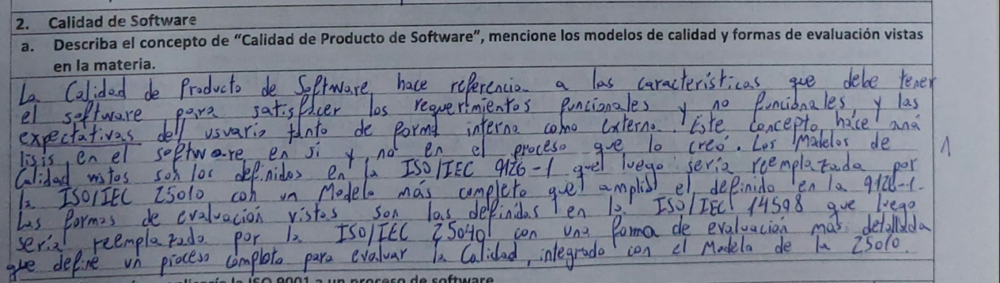

---

**B) Explique cómo aplicaría la ISO 9001 a un proceso de software.**

Respuesta

Para aplicar la ISO 9001 a un proceso de software hay que usar las directrices definidas en la ISO 90003:2018 que nos permiten entender los requisitos de la 9001 en el contexto de un proceso de software.

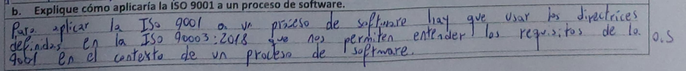

---

**C) Clasifique las siguientes características del modelo de calidad de datos ISO/IEC 25012 considerando los puntos de vista.**

Imagen Parcial (No mirar)

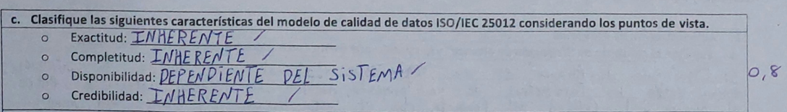

Exactitud:

**INHERENTE** ✔

 

Completitud:

**INHERENTE** ✔

 

Disponibilidad:

**DEPENDIENTE DEL SISTEMA** ✔

 

Credibilidad:

**INHERENTE** ✔

 

---

**D) Sistema de Gestión de la Calidad (SGC)**

Imagen Parcial

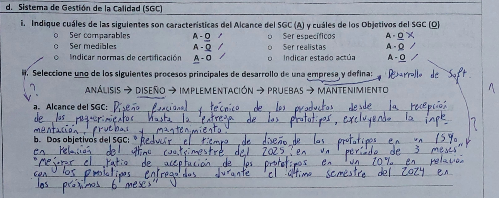

**i. Indique cuáles de las siguientes son características del Alcance del SGC (A) y cuáles de los Objetivos del SGC (O)**

Ser comparables
O ✔

Ser medibles
O ✔

Indicar normas de certificación
A ✔

Ser específicos
A✔

Ser realistas
O ✔

Indicar estado actual
O ✔

**ii. Seleccione uno de los siguientes procesos principales de desarrollo de una empresa y defina:**

**ANÁLISIS → DISEÑO → IMPLEMENTACIÓN → PRUEBAS → MANTENIMIENTO**

**a. Alcance del SGC:**

Respuesta

*Diseño funcional y técnico de los productos desde la recepción de los requerimientos hasta la entrega de los prototipos, excluyendo la implementación, pruebas y mantenimiento.*

**b. Dos objetivos del SGC:**

Respuesta

1. *Reducir el tiempo de diseño de los prototipos en un 15% en relación al último cuatrimestre del 2023, en un período de 3 meses.*
2. *“Mejorar el ratio de aceptación de los prototipos en un 20% en relación con los prototipos entregados durante el último semestre del 2024 en los próximos 6 meses.”*

---

## **3. Auditoría de Sistemas**

**A) Defina, con sus palabras, qué es una “Auditoría de Sistemas de Información”. Mencione cuáles son los cuatro objetivos.**

Respuesta

La Auditoría de Sistemas de Información es el proceso sistemático y planificado mediante el cual se recolecta, analiza y evalúa evidencia de sistemas de información de una organización con el propósito de preservar los activos, usar los recursos con eficiencia, mantener la integridad de los datos y alcanzar los objetivos estratégicos con eficacia.

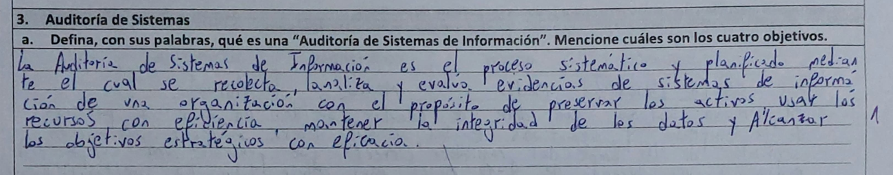

---

**B) Indique cuáles de los siguientes son tipos de riesgos de auditoría.**

Imagen Parcial (No mirar)

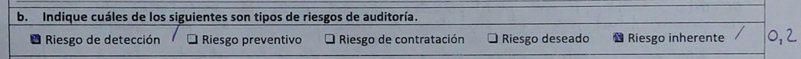

Riesgo de detección
SI
 

Riesgo preventivo
NO

Riesgo de contratación
NO

Riesgo deseado
NO

Riesgo inherente
SI

---

**C) Indique de qué tipo de opinión de auditoría se trata en cada uno de los siguientes casos**

Imagen Parcial (No mirar)

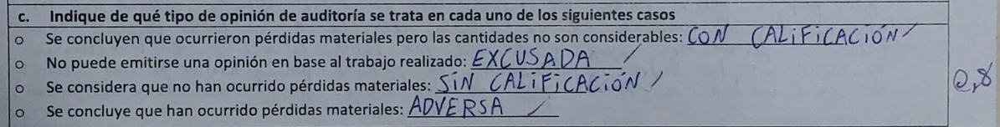

Se concluye que ocurrieron pérdidas materiales pero las cantidades no son considerables: 
CON CALIFICACIÓN ✔

No puede emitirse una opinión en base al trabajo realizado:
EXCUSADA ✔

Se considera que no han ocurrido pérdidas materiales:
SIN CALIFICACIÓN ✔

Se concluye que han ocurrido pérdidas materiales:
ADVERSA ✔

---

**D) Presente un ejemplo de cómo un mal procesamiento de información realizado por un sistema informático puede conducir a una toma de decisiones incorrecta para el gerente de una empresa vinculada a la industria hotelera**

Respuesta

Si un sistema informático automatizado para la industria hotelera calcula mal la cantidad de habitaciones disponibles de un hotel o asigna como libres habitaciones que no lo están, podría llevar a malas decisiones a la hora de por ejemplo contactarse con proveedores y pedir X insumos de limpieza o comida cuando se necesitan Y.

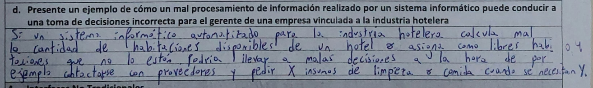

---

## **4. Interfaces No Tradicionales**

Imagen Parcial (No mirar)

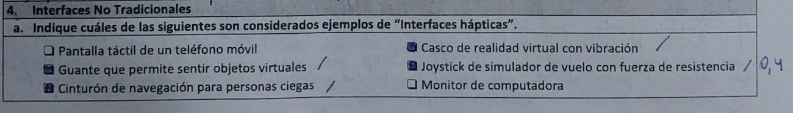

**a. Indique cuáles de las siguientes son considerados ejemplos de “Interfaces hápticas”.**

Pantalla táctil de un teléfono móvil
NO

Guante que permite sentir objetos virtuales
SI

Cinturón de navegación para personas ciegas
SI

Casco de realidad virtual con vibración
SI

Joystick de simulador de vuelo con fuerza de resistencia
SI

Monitor de computadora
NO

---

# Primera Fecha 2023

## **1) Administración de Proyectos**

**a. Explique el concepto de “Triángulo de alcance”.**

Respuesta

---

**b. El modelo COCOMO original es una colección de tres modelos. Detalle cuáles son y explique las diferencias entre ellos.**

Respuesta

---

**c. Indique de las siguientes cuáles son características de un programa y cuáles de un proyecto.**

Tienen un amplio alcance que puede cambiar para satisfacer las expectativas: 
**PROGRAMA**

Se realiza una planificación detallada para administrar la entrega de productos y servicios: 
**PROYECTO**

El estilo de liderazgo se centra en la gestión de las relaciones y la resolución de conflictos: 
**PROGRAMA**

El éxito se mide por el presupuesto, el tiempo de entrega y los productos que cumplen las especificaciones: 
**PROYECTO**

---

**d.** Una empresa de viajes cuenta con una planta de 30 empleados. En base a requerimientos de los directivos, se definió la ejecución de un proyecto para proveer un sistema de reservas.

**i. Clasificar el proyecto según *Duración*, *Riesgo*, *Complejidad* y *Tecnología*. Justificar.**

| **DURACIÓN** | **RIESGO** | **COMPLEJIDAD** | **TECNOLOGÍA** |
| ------------ | ---------- | --------------- | -------------- |
| -            | _          | _               | __             |

**ii. Identifique un stakeholder del proyecto y elabore un plan de comunicación donde este sea QUIEN comunica.**

---

## **2. Calidad de Software**

**A) Describa el concepto de “Calidad de Producto de Software”, mencione los modelos de calidad y formas de evaluación vistas en la materia.**

---

**B) Explique cómo aplicaría la ISO 9001 a un proceso de software.**

---

**C) Clasifique las siguientes características del modelo de calidad de datos ISO/IEC 25012 considerando los puntos de vista.**

Exactitud:
 Inherente ✔

Completitud:
 Inherente y dependiente del sistema ✘

Disponibilidad:
 Dependiente del sistema ✔

Credibilidad:
 Inherente y dependiente del sistema ✘

---

**D) La siguiente métrica para la característica Mantenibilidad ha sido extraída de la norma ISO/IEC 23023.**

<table border="1">
  <thead>
    <tr>
      <th>Metric name</th>
      <th>Description</th>
      <th>Measurement function</th>
      <th>Interpretation of measured value</th>
    </tr>
  </thead>
  <tbody>
    <tr>
      <td>Coding rules conformity</td>
      <td>How many modules conform to required coding rules?</td>
      <td>
        X = A / B 
        A = Number of software modules conforming to coding rules for a specific system 
        B = Number of software modules implemented
      </td>
      <td>
        0 &lt; X ≤ 1 
        The closer to 1 is the better.
      </td>
    </tr>
  </tbody>
</table>

**i. Explique cómo combinaría 3 aplicaciones de esta métrica con distintas reglas de estilo para obtener un valor para la característica Mantenibilidad (en sus 4 niveles).**

**ii. Explique qué debería hacer en el caso de querer crear una nueva métrica para esta característica.**

---

## **3. Auditoría de Sistemas**

**a. Explique por qué un control en un sistema de información es un sistema.**

---

**b. Explique la diferencia entre Gobernanza y Administración de TI.**

---

**c. Indique de qué tipo de opinión de auditoría se trata en cada uno de los siguientes casos**

Se concluyen que ocurrieron pérdidas materiales pero las cantidades no son considerables: 
Opinión Innerente X

No puede emitirse una opinión en base al trabajo realizado: 
Opinión excusada ✔

Se considera que no han ocurrido pérdidas materiales: 
Opinión sin calificación ✔

Se concluye que han ocurrido pérdidas materiales: 
Opinión con Clasificacion X

---

**d. Suponga que usted debe auditar un proceso de software y recibe un plan de evaluación que no se encuentra del todo completo**

i. Indique qué debería hacer en primera instancia, antes de comenzar con la auditoría

Comunicarme con el cliente o empresa a auditar para completar el plan de evaluación teniendo en cuenta sus objetivos e intereses, yendo a la fuente.

ii. En base a lo obtenido en la auditoría, indique qué debería tener en cuenta para poder redactar un informe

Antes de redactar el informe se deben tener en claro cuáles son los objetivos de la auditoría, cuáles fueron las acciones y hallazgos durante el proceso y qué se le recomienda se corrija, mejore ante los fallos y vulnerabilidades.

---

# Segunda Fecha 2022

## **1) Administración de Proyectos**

**a. Elija dos métodos de estimación de esfuerzo vistos en la materia y describa de qué forma son llevados a cabo.**

---

**b. Explique tres actividades que se lleven a cabo en la Gestión de Stakeholder.**

---

**c. PROGRAMAS Y PROYECTOS**

**i. Explique cuáles son las características de los Programas y de los Proyectos. Mencione la relación entre ambos conceptos.**

**ii. Elegir una organización y describir a qué se dedica. Formular un objetivo estratégico para el cual se necesite la ejecución de un programa e indique: cuál sería el mismo y qué proyectos incluiría.**

---

## **2) Calidad de Software**

**a. Describa el concepto de “Calidad de Procesos de Software”, mencione los modelos de calidad y formas de evaluación vistas en la materia.**

---

**b. Explique cómo aplicaría la ISO 9001 a un proceso de software.**

---

**c. Las siguientes métricas para la características Usabilidad han sido extraidas de la norma ISO/IEC 9126-2**

<table border="1">
  <thead>
    <tr>
      <th>Metric name</th>
      <th>Purpose of the metric</th>
      <th>Method of application</th>
      <th>Measurement, formula and data element computations</th>
      <th>Interpretation of measured value</th>
    </tr>
  </thead>
  <tbody>
    <tr>
      <td>Effectiveness of user documentation</td>
      <td>What proportion of functions can be used correctly after reading the documentation?</td>
      <td>Count the number of functions used correctly after reading the documentation and compare with the total number of functions.</td>
      <td>
        X = A / B 
        A = No. of functions that can be used 
        B = Total of functions provided
      </td>
      <td>0 &lt;= X &lt;= 1 The closer to 1 is the better.</td>
    </tr>
    <tr>
      <td>Help frequency</td>
      <td>How frequently does a user have to access help to learn operation to complete his/her work task?</td>
      <td>Count the number of cases that a user accesses help to complete his/her task.</td>
      <td>
        X = A 
        A = No. of accesses to help until a user completes his/her task.
      </td>
      <td>0 &lt;= X The closer to 0 is the better.</td>
    </tr>
  </tbody>
</table>

**i. Explique de qué forma se pueden combinar las métricas 'Effectivennes of user documentation' y 'Help frequency'**

**ii. Explique qué debería hacer en el caso de querer crear una nueva métrica para la característica Usabilidad**

---

## 3) Auditoria de Sistemas

**a. Defina que es una "Auditoria de Sistemas de Información"**

---

**b. Explique las diferencias entre control preventivo, control detectivo y control correctivo. Dé un ejemplo para cada tipo.**

---

**c. Explique dos características que diferencien entre un abuso informático y otro tipo de fraude comercial.**

## **4. Sistemas Colaborativos**
**a. Explique qué son los sistemas colaborativos y dé ejemplos de 3 tipos de sistemas distintos.**
