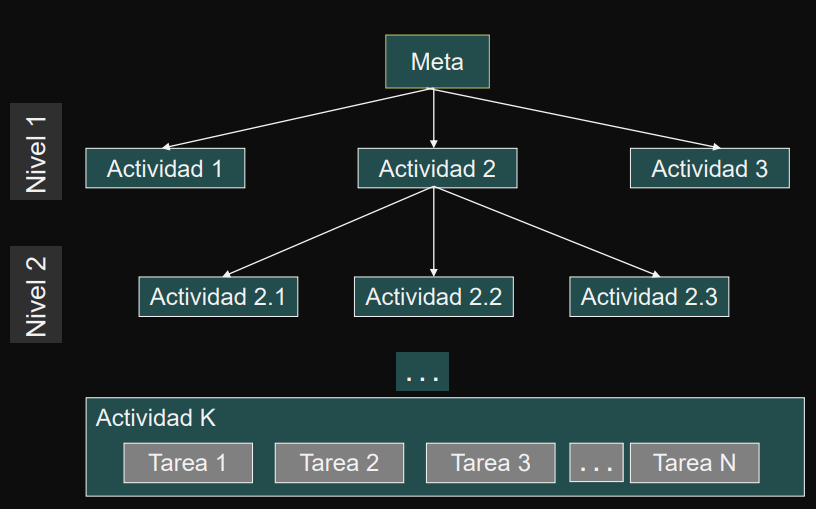

# Teoría  Administración de Proyectos

---

> Introducir e ilustrar conceptos básicos relacionados con la administración de proyectos.

- [1 ¿Qué es un proyecto?]()
- [2 ¿Qué significa administrar un proyecto?]()
- [3 ¿Qué es un programa y cuál es la relación con proyectos?]()
- [4 ¿Qué se cubrió en esta sesión[]]()

---

## Proyecto

**[DEFINICIÓN –R. WYSOCKI]**

Un proyecto es una secuencia de actividades única, complejas y conectadas que  tienen un objetivo o propósito y que deben ser completadas en un tiempo específico,  dentro del presupuesto y de acuerdo a las especificaciones.

- Es cualquier actividad que dé como resultado un producto o un **`entregable`**
- Es una organización temporal creada con el propósito de entregar uno o más productos empresariales dentro de las restricciones de costo, calidad y recursos

**Caracteristicas**

- Los proyectos tienen un alcance limitado con productos concretos.
- El éxito se mide por el presupuesto, el tiempo de entrega y los productos que  cumplen las especificaciones.
- Durante la ejecución de un proyecto, se trata de mantener los cambios al mínimo.
- El proyecto es dirigido y coordinado por una persona responsable - líder o  gerente de proyecto; quien administra el tiempo, los recursos y el presupuesto

