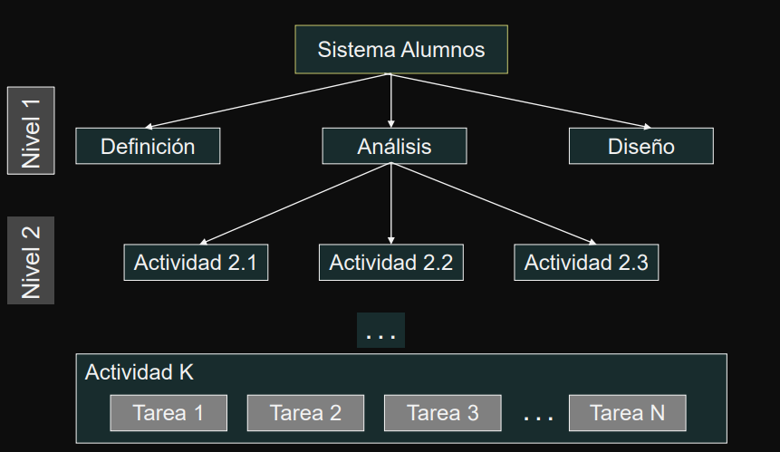

# Teoría  Administración de Proyectos

---

Indice

- [Proyecto](#proyecto)
    - [Definición](#definición)
    - [Características](#caracteristicas)
    - [Responsable de Proyecto](#responsable-de-proyecto)
    - [Tareas del Responsable de Proyecto](#tareas-del-responsable-de-proyecto)
    - [Parámetros de un Proyecto](#parámetros-de-un-proyecto)
        - [Alcance](#alcance)
        - [Calidad](#calidad)
        - [Recursos](#recursos)
    - [Triángulo de Alcance](#triángulo-de-alcance)

---

## Proyecto

> [!NOTE]
> Introducir e ilustrar conceptos básicos relacionados con la administración de proyectos.

### Definición

Un proyecto es una secuencia de actividades única, complejas y conectadas que  tienen un objetivo o propósito y que deben ser completadas en un tiempo específico,  dentro del presupuesto y de acuerdo a las especificaciones.

- Es cualquier actividad que dé como resultado un producto o un **`entregable`**
- Es una organización temporal creada con el propósito de entregar uno o más productos empresariales dentro de las restricciones de costo, calidad y recursos

---

### Caracteristicas

- Los proyectos tienen un alcance limitado con productos concretos.
- El éxito se mide por el presupuesto, el tiempo de entrega y los productos que  cumplen las especificaciones.
- Durante la ejecución de un proyecto, se trata de mantener los cambios al mínimo.
- El proyecto es dirigido y coordinado por una persona responsable - líder o  gerente de proyecto; quien administra el tiempo, los recursos y el presupuesto

---

### Responsable de Proyecto

**[LÍDER DE PROYECTO - DEFINICIÓN]**

Es el responsable de detectar las necesidades de los usuarios y gestionar los recursos económicos, materiales y humanos, para obtener los resultados esperados en los plazos previstos y con la calidad necesaria.

- Coordina el trabajo de técnicos y especialistas y la comunicación con 
interesados
- Son jugadores de equipo que motivan al personal usando sus conocimientos  y habilidades
- Realizan una planificación detallada para administrar la entrega de productos y servicios

---

### Tareas del Responsable de Proyecto

- Desarrollar el plan del proyecto
- Identificar requerimientos y el alcance del proyecto
- Comunicar y reportar a interesados
- Administrar recursos humanos y materiales
- Controlar tiempos
- Identificar y controlar riesgos
- Administrar costos y presupuesto
- Asegurar de la calidad
- Evaluar el desempeño del proyecto

---

### Parámetros de un Proyecto

Existen cinco restricciones que operan sobre un proyecto:

- `1)` Alcance
- `2)` Calidad
- `3)` Costo
- `4)` Tiempo
- `5)` Recursos

Son interdependientes - un cambio en una, implica un cambio en las demás. 

#### **Alcance**
Es un enunciado que define los límites del proyecto. Dice lo que se va a hacer, pero  implícitamente también dice lo que no se va a hacer.

- Es crítico que el alcance sea correcto. 
- El alcance puede cambiar  
- En caso de que se produzca un cambio al alcance, detectarlo  y decidir como acomodar el plan del proyecto es un desafío del líder de proyecto.

#### **Calidad**

Existen dos calidades a tener en cuenta en el desarrollo: 
- `1)` calidad del producto 
- `2)` calidad del proceso

#### Recursos

Son activos, tales como personas, equipos, facilidades físicas, o artefactos necesarios para la realización del proyecto

- Tienen disponibilidad limitada, su uso puede planificarse, o puede ser contratado a una tercera parte.
- Algunos son fijos y otros variables a largo plazo. 
- Son centrales a la planificación de las actividades del proyecto y para la finalización ordenada del mismo.
- Para los proyectos de desarrollo de sistemas, las personas constituyen el recurso más importante.

---

## Triángulo de Alcance

<table><td>

</td><td>

Los proyectos son sistemas dinámicos que deben ser mantenidos en equilibrio.

**`Tiempo`**: es la ventana de tiempo en la cual el proyecto debe terminarse.

**`Costo`**: es el presupuesto disponible para completar el proyecto.

**`Recursos`**: es cualquier insumo o consumible usado en el proyecto - personas, equipos, oficinas, papel,...

Son controlados por el líder del proyecto  y necesitan ser identificados de manera  independiente
</td></table>