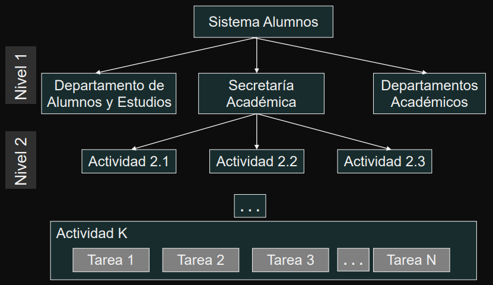

# Teoría  Administración de Proyectos

---

Indice

- [Proyecto](#proyecto)
    - [Definición](#definición)
    - [Características](#caracteristicas)
    - [Responsable de Proyecto](#responsable-de-proyecto)
    - [Tareas del Responsable de Proyecto](#tareas-del-responsable-de-proyecto)
    - [Parámetros de un Proyecto](#parámetros-de-un-proyecto)
        - [Alcance](#alcance)
        - [Calidad](#calidad)
        - [Recursos](#recursos)
    - [Triángulo de Alcance](#triángulo-de-alcance)
    - [Clasificación de Proyectos](#clasificación-de-proyectos)
    - [Causas de fracaso de proyectos](#causas-de-fracaso-de-proyectos)
- [Administración](#administración-de-proyectos)
    - [Definición 1](#definición-1)
    - [Definición 2](#definición-2)
    - [Definición 3](#definición-3)
    - [Definición 4](#definición-4)
    - [Relevancia de administrar proyectos](#relevancia-de-administrar-proyectos)
    - [Desafíos de la administración de proyectos](#desafíos-de-la-administración-de-proyectos)
    - [Principios de una buena administración](#principios-de-una-buena-administración)
    - [Ciclo de vida de un proyecto](#ciclo-de-vida-de-un-proyecto)
- [Programas](#programas)

---

## Proyecto

**Objetivo**

Introducir e ilustrar conceptos básicos relacionados con la administración de proyectos.

### Definición

Un proyecto es una secuencia de actividades única, complejas y conectadas que  tienen un objetivo o propósito y que deben ser completadas en un tiempo específico,  dentro del presupuesto y de acuerdo a las especificaciones.

- Es cualquier actividad que dé como resultado un producto o un **`entregable`**
- Es una organización temporal creada con el propósito de entregar uno o más productos empresariales dentro de las restricciones de costo, calidad y recursos

---

### Caracteristicas

- Los proyectos tienen un alcance limitado con productos concretos.
- El éxito se mide por el presupuesto, el tiempo de entrega y los productos que  cumplen las especificaciones.
- Durante la ejecución de un proyecto, se trata de mantener los cambios al mínimo.
- El proyecto es dirigido y coordinado por una persona responsable - líder o  gerente de proyecto; quien administra el tiempo, los recursos y el presupuesto

---

### Responsable de Proyecto

**[LÍDER DE PROYECTO - DEFINICIÓN]**

Es el responsable de detectar las necesidades de los usuarios y gestionar los recursos económicos, materiales y humanos, para obtener los resultados esperados en los plazos previstos y con la calidad necesaria.

- Coordina el trabajo de técnicos y especialistas y la comunicación con 
interesados
- Son jugadores de equipo que motivan al personal usando sus conocimientos  y habilidades
- Realizan una planificación detallada para administrar la entrega de productos y servicios

---

### Tareas del Responsable de Proyecto

- Desarrollar el plan del proyecto
- Identificar requerimientos y el alcance del proyecto
- Comunicar y reportar a interesados
- Administrar recursos humanos y materiales
- Controlar tiempos
- Identificar y controlar riesgos
- Administrar costos y presupuesto
- Asegurar de la calidad
- Evaluar el desempeño del proyecto

---

### Parámetros de un Proyecto

Existen cinco restricciones que operan sobre un proyecto:

- `1)` Alcance
- `2)` Calidad
- `3)` Costo
- `4)` Tiempo
- `5)` Recursos

Son interdependientes - un cambio en una, implica un cambio en las demás. 

#### **Alcance**
Es un enunciado que define los límites del proyecto. Dice lo que se va a hacer, pero  implícitamente también dice lo que no se va a hacer.

- Es crítico que el alcance sea correcto. 
- El alcance puede cambiar  
- En caso de que se produzca un cambio al alcance, detectarlo  y decidir como acomodar el plan del proyecto es un desafío del líder de proyecto.

#### **Calidad**

Existen dos calidades a tener en cuenta en el desarrollo: 
- `1)` calidad del producto 
- `2)` calidad del proceso

#### Recursos

Son activos, tales como personas, equipos, facilidades físicas, o artefactos necesarios para la realización del proyecto

- Tienen disponibilidad limitada, su uso puede planificarse, o puede ser contratado a una tercera parte.
- Algunos son fijos y otros variables a largo plazo. 
- Son centrales a la planificación de las actividades del proyecto y para la finalización ordenada del mismo.
- Para los proyectos de desarrollo de sistemas, las personas constituyen el recurso más importante.

---

## Triángulo de Alcance

<table><td>

</td><td>

Los proyectos son sistemas dinámicos que deben ser mantenidos en equilibrio.

**`Tiempo`**: es la ventana de tiempo en la cual el proyecto debe terminarse.

**`Costo`**: es el presupuesto disponible para completar el proyecto.

**`Recursos`**: es cualquier insumo o consumible usado en el proyecto - personas, equipos, oficinas, papel,...

Son controlados por el líder del proyecto  y necesitan ser identificados de manera  independiente
</td></table>

---

## Clasificación de Proyectos

- `1)` Duración
- `2)` Riesgo
- `3)` Complejidad
- `4)` Valor comercial
- `5)` Costo

**Ejemplo**

---

## Causas de fracaso de proyectos

**No prestar la suficiente atención a ...**
- caso de negocio
- calidad
- definición y medida de los entregables

**Inadecuada ...**
- definición de responsabilidades
- planificación y coordinación de recursos

**Pobre estimación de ...**
- duración
- costos

**Falta de ...**
- comunicación con los interesados
- compromiso de los interesados
- control de calidad
- control de avance

---

## Administración de Proyectos

**Objetivo**

Introducir e ilustrar conceptos básicos relacionados con la administración de proyectos

### Definición 1

Es la planificación, la delegación, el seguimiento y el control de todos los aspectos del proyecto y la motivación de los participantes para alcanzar los objetivos del proyecto dentro de los objetivos de rendimiento esperados en términos de tiempo, costo, calidad, alcance, beneficios y riesgos.

---

### Definición 2

La administración de proyectos es la aplicación de conocimientos, habilidades,  herramientas y técnicas a actividades de proyectos para satisfacer los requisitos del proyecto.

La administración del proyecto se logra mediante el uso de los procesos tales como: iniciar, planificar, ejecutar, controlar y cerrar.

---

### Definición 3

Se trata de las habilidades, herramientas y procesos de gestión necesarios para llevar a cabo un proyecto con éxito

---

### Definición 4

El objetivo de administrar un proyecto de software es aplicar buenos principios y técnicas de administración de proyectos y de ingeniería de software a fin de que el producto se entregue al mínimo costo, mínimo tiempo y sea de buena calidad

---

### Relevancia de administrar proyectos

- En el 2016, menos de 1/3 parte de los proyectos se terminaron exitosamente en tiempo y de acuerdo al presupuesto.
- En 2016, por cada `$1000` millones invertidos en los Estados Unidos, `$122` millones (12,2%) se perdieron debido a la falta de rendimiento del proyecto
- `71%` de los proyectos alcanzan los objetivos originales y las metas del negocio cuando la cultura de administración de proyectos es de alta prioridad

---

### Desafíos de la administración de proyectos

- Ato nivel de innovación
- Complejidad
- Requerimientos ambiguos
- Falta de competencias necesarias
- Herramientas y técnicas inmaduras
- Cumplir con regulaciones de gobierno
- Cumplir con plazos
- Tratar con proveedores
- Reportar a altas autoridades
- Retener personal calificados
- Administrar personal con diferentes niveles de productividad
- Administrar equipos distribuidos en diferentes ubicaciones
- Administrar entornos multi-culturales y multi-lingua.

---

### Principios de una buena administración

- Los proyectos siempre necesitan ser gestionados para tener éxito
- El proyecto es un proceso finito con un comienzo y un final definidos
- Se requiere un compromiso sincero de todos los interesados
- Normalmente se requiere entrenamiento.

---

### Ciclo de vida de un proyecto

---

## Programas

Introducir e ilustrar conceptos básicos relacionados con la administración de proyectos.