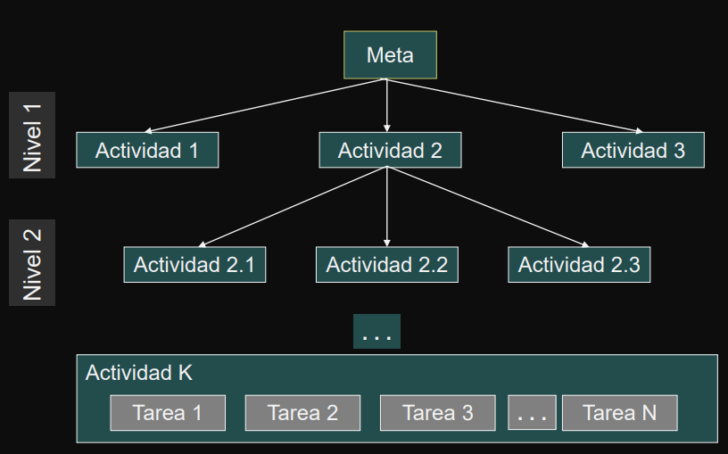
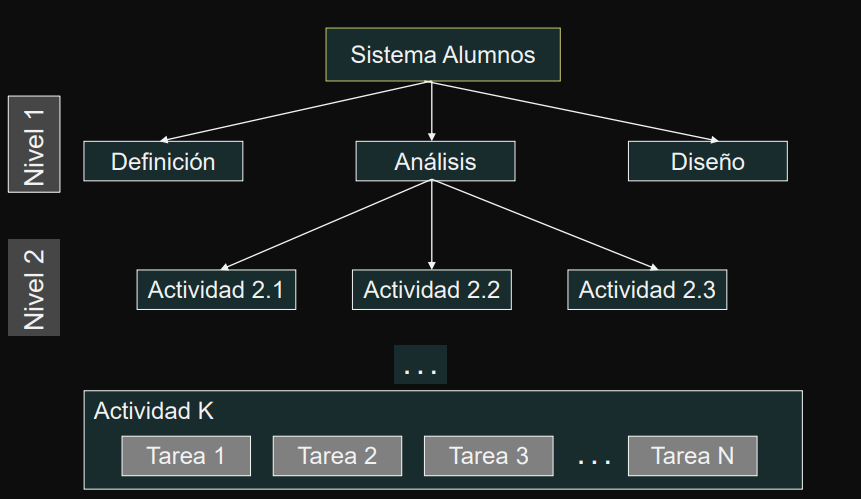

# Teoría  Administración de Proyectos

---

Indice
- [WBS](#wbs)
    - [WBS - Work Breakdown Structure](#wbs---work-breakdown-structure)
    - [WBS - Usos](#wbs---usos)
    - [WBS - Construcción](#wbs---construcción)
        - [WBS - Construcción - Top-Down Equipo Completo](#wbs---construcción---top-down-equipo-completo)
        - [WBS - Construcción - Top Down Sub Equipos](#wbs---construcción---top-down-sub-equipos)
        - [WBS - Construcción - Bottom Up](#wbs---construcción---bottom-up)
- [Terminación](#terminación)
    - [WBS - Cómo determinar completitud](#wbs---cómo-determinar-completitud)
        - [Completitud - Estado Medible](#completitud---estado-medible)
        - [Completitud - Acotada](#completitud---acotada)
        - [Completitud - Producir un entregable](#completitud---producir-un-entregable)
        - [Completitud - Tiempo y Costo Estimable](#completitud---tiempo-y-costo-estimable)
        - [Completitud - Duración Aceptable](#completitud---duración-aceptable)
        - [Completitud - Independiente](#completitud---independiente)
    - [WBS - Enfoques para definición de actividades](#wbs---enfoques-para-definición-de-actividades)
        - [WBS - Enfoque por sustantivos](#wbs---enfoque-por-sustantivos)
        - [WBS - Enfoque por verbos](#wbs---enfoque-por-verbos)
        - [WBS - Enfoque organizacional](#wbs---enfoque-organizacional)
- [Duración](#duración)
    - [Carga de recursos vs Duración 1](#carga-de-recursos-vs-duración-1)
    - [Carga de recursos vs Duración 2](#carga-de-recursos-vs-duración-2)
    - [Variaciones en la duración](#variaciones-en-la-duración)
        - [Duración - Variación en los perfiles](#duración---variación-en-los-perfiles)
        - [Duración - Eventos inesperados](#duración---eventos-inesperados)
        - [Duración - Eficiencia del tiempo de trabajo](#duración---eficiencia-del-tiempo-de-trabajo)
        - [Duración - Errores e interpretaciones erróneas](#duración---errores-e-interpretaciones-erróneas)
    

---

## WBS

Presentart técnicas para definir las actividades y tareas de un proyecto

### WBS - Work Breakdown Structure

**`WBS`**: es una descripción jerárquica del trabajo que se debe realizar para completar el proyecto.

- Es similar a una descomposición funcional.
- El trabajo se divide en **`actividades`**.
- Las actividades se dividen en **`tareas`**.
- Es la convención que utilizaremos, otros autores la intercambian.

---

### WBS - Graficamente

---

### WBS - Usos

El WBS es una herramienta para:

- **`1)`** **`diseñar y planificar el trabajo`**: permite a los integrantes del equipo visualizar cómo puede definirse y administrarse el trabajo del proyecto.
- **`2)`** **`diseñar la arquitectura`**: es un gráfico del trabajo del proyecto, muestra cómo se relacionan los distintos ítems de trabajo a realizar.
- **`3)`** **`planificar`**: se debe estimar esfuerzo , tiempos, y recursos para el último nivel.
- **`4)`** **`informar el estado del proyecto`**: es usada como una estructura para mostrar el grado de avance.

---

### WBS - Construcción

Su confección es responsabilidad del `LP`.

Debe definirse de tal manera que el `LP` pueda administrar el proyecto.

Manera de que funcione: stickers, resaltadores, pizarrón, paredes.

Formas de construirlo:
- 1) Top-Down
    - **`a)`** equipo completo
    - **`b)`** sub-equipos
- 2) Bottom-up

#### WBS - Construcción - Top-Down Equipo Completo

Todos los miembros del equipo participan de la descomposición.

Se comienza con el nivel 0 (el de la meta) y se particiona sucesivamente hasta que los participantes estén satisfechos de que el trabajo ha sido suficientemente definido.

Debido a que las actividades se definen con el suficiente nivel de detalle, las estimaciones de costo, tiempo y recursos son más exactas.

Una vez que las actividades se han definido, se deben secuenciar. Se debe analizar qué actividades se pueden hacer concurrentemente.

**`Ventaja`**: brinda la oportunidad de que todos presten atención al WBS, y se discuta en el momento.

#### WBS - Construcción - Top Down Sub Equipos

El equipo completo acuerda la partición del primer nivel.

Se crean tantos sub-equipos como actividades haya en el nivel uno. 

Cada sub-equipo particiona una actividad (se le asigna la actividad para la cual tenga más experiencia).

Un sub-equipo puede solicitar ayuda externa.

Demanda menos tiempo que el enfoque anterior

#### WBS - Construcción - Bottom Up

Se asemeja a una lluvia de ideas (brainstorming).

El equipo completo acuerda la partición del primer nivel

Se crean tantos sub-equipos como actividades haya en el nivel uno. 

Cada sub-equipo particiona una actividad (se le asigna la actividad para la cual tenga más experiencia). Cada grupo hace una lista de actividades en las cuales se descompone la actividad de nivel 1 asignada.

Los integrantes presentan ideas sobre las tareas que involucra cada una de esas sub-actividades.

El grupo clasifica las actividades que parecieran relacionarse. 

Se reunen todos los grupos y cada grupo presenta sus resultados. Se discute en conjunto.

La desventaja de este enfoque es no definir las tareas con el suficiente grado de granularidad.

Existen metodologías que ayudan a la descomposición de actividades: proveen listados de las tareas.

---

## Terminación

Presentart técnicas para definir las actividades y tareas de un proyect

### WBS - Cómo determinar completitud

Cada actividad debe poseer 6 características para considerarse completa:

- **`1)`** Estado medible
- **`2)`** Acotada
- **`3)`** Producir un entregable
- **`4)`** Tiempo y costo estimable
- **`5)`** Duración aceptable
- **`6)`** Independiente

#### Completitud - Estado Medible

El estado de una actividad debe ser medible - en cualquier momento  se debería poder determinar el estado en que se encuentra.

**`Ejemplo`**: codificar 10 componentes de 10.000 líneas de código. Tiempo asignado: 10 semanas.

Luego de 4 semanas el LP pregunta cuál es el estado de la  tarea. 

¿Cuáles serían las respuestas válidas?

#### Completitud - Acotada

Una actividad debe ser acotada.

Debe poseer:

- **`1)`** evento de comienzo → fecha de comienzo
- **`2)`** evento de fin →fecha de fin

#### Completitud - Producir un entregable

Una actividad debe producir un entregable. El entregable es un signo visible de que la actividad se completó.

Puede ser:

- **`1)`** un producto
- **`2)`** un documento
- **`3)`** la autorización para continuar con la próxima tarea,
- **`4)`** etc.

#### Completitud - Tiempo y Costo Estimable

Una actividad debe tener un tiempo y un costo medibles.

El tiempo y costo deben ser fácilmente estimables.

Realizar la estimación de tiempo y costo para las tareas de menor nivel, permite luego agregar y calcular el costo y tiempo total del proyecto.

#### Completitud - Duración Aceptable

La duración de una actividad debe ser aceptable.

En lo posible no trabajar con tareas de más de 10 días  - 2 semanas laborables. 

Cuidado: hay excepciones.

#### Completitud - Independiente

Una actividad debe ser independiente.

Es importante la independencia de actividades.

Una vez que se comenzó una actividad se debe poder continuar razonablemente sin interrupciones y sin la necesidad de un input adicional. 

El esfuerzo dedicado a una actividad debe ser continuo.

---

### WBS - Enfoques para definición de actividades

No hay reglas. 

Se pueden estipular criterios para nombrar las tareas:

- **`1)`** **Enfoque por sustantivos**: en función de los entregables.
- **`2)`** **Enfoque por verbos**: en función de las acciones requeridas para producir el entregable.
- **`3)`** **Enfoque organizacional**: en función de las unidades organizativas que trabajarán en el proyecto.

#### WBS - Enfoque por sustantivos

#### WBS - Enfoque por verbos

#### WBS - Enfoque organizacional

---

## Duración

**`Duración`** es el tiempo transcurrido en días laborables para finalizar el proyecto - sin considerar feriados, fines de semana, días no laborables.

**`Esfuerzo de Trabajo`** es la labor requerida para completar una actividad. La labor se puede realizar en horas consecutivas o no.

La **duración** es diferente al **esfuerzo de trabajo**.

Duración: 10 días - Esfuerzo de trabajo: 20 horas

El **tiempo transcurrido** es diferente al **tiempo de trabajo** en una actividad. Existen imprevistos, interrupciones, actividades sociales.

---

### Carga de recursos vs Duración 1

La duración de una actividad es influenciada por la cantidad de recursos planificados para trabajar en ella.

Se dice **``influenciada``**, ya que no es una relación lineal directa entre la cantidad de recursos asignados a la tarea y la duración de la misma.

**`Crash de la Actividad`**: agregar más recursos para mantener la duración de una actividad dentro de los límites planificados.

Ejemplo: traslado de la silla con una persona y con dos personas.

---

### Carga de recursos vs Duración 2

Crashpoint de la Actividad: es el punto en el cual agregar más recursos aumenta la duración de la actividad.

Ejemplo: traslado de la silla con cuatro personas.

El agregar n personas a una actividad, hace que se agreguen:

- **`1)`** como mínimo n canales de comunicación más 
- **`2)`** trabajo de coordinar a estas personas
- **`3)`** nuevas tareas (capacitación, supervisión, coordinación)

Otra consideración para el LP al agregar recursos a una actividad es considerar el impacto del riesgo de esta decisión. Ej: distintos enfoques de trabajo, mayor probabilidad que alguien tenga problemas, ...

--- 

### Variaciones en la duración

Existen distintas causas por las variaciones a la duración de una  actividad:

- **`1)`** variación en los perfiles
- **`2)`** eventos inesperados
- **`3)`** eficiencia del tiempo de trabajo
- **`4)`** errores e interpretaciones erróneas

#### Duración - Variación en los perfiles

La estrategia es estimar la duración de la actividad basados en  personas con un determinado perfil para la actividad. 

Las personas asignadas pueden tener distintos perfiles y esto implica cambios en la duración.

#### Duración - Eventos inesperados

- **`1)`** demoras de proveedores
- **`2)`** fallas  de energía
- **`3)`** incorrecto envío de materiales
- **`4)`** enfermedades
- **`5)`** problemas técnicos
- **`6)`** ...

#### Duración - Eficiencia del tiempo de trabajo

Cada vez que un trabajador es interrumpido, le demanda más tiempo volver al nivel de productividad previo al momento de  la interrrupción.

Se logra mayor eficiencia al realizar trabajos de manera focalizada.

Algunas personas se ven mas afectadas que otras.

#### Duración - Errores e interpretaciones erróneas

Existen errores e interpretaciones erróneas sobre los trabajos a realizar. 

Esto puede implicar rehacer trabajo ya hecho

---

### Duración - Métodos de Estimación

Existen distintas técnicas para estimar esfuerzo:
- **`1)`** similitud con otras actividades
- **`2)`** datos históricos
- **`3)`** juicio experto
- **`4)`** técnica Delphi
- **`5)`** técnica de 3 puntos
- **`6)`** técnica Delphi de banda ancha

#### Duración - Similitud con otras actividades

Estimar en base a las estimaciones de actividades similares de otros proyectos.

Los datos están en la memoria de las personas.

#### Duración - Datos históricos

Estimar en base a las estimaciones de actividades similares de otros proyectos.

Los datos están en un registro –base de datos, no sólo en la memoria de las personas.

La base de datos histórica puede ser tan sofisticada como se desee.

#### Duración - Juicio experto

Las estimaciones las realizan consultores externos o vendedores con experiencia en la metodología o en la tecnología.

Si el juicio experto se basa en la estimación de vendedores, las estimaciones pueden no ser objetivas.

#### Duración - Técnica Delphi

Es una técnica de grupo que extrae y resume el conocimiento del grupo para arribar a una estimación. 

Se le pide a cada miembro del grupo a que realice su estimación.

**Primera Pasada**

Los resultados de la estimación son tabulados de la siguiente manera, rotulados como Primera Pasada: 

**Segunda Pasada**

Aquellos participantes cuyas estimaciones cayeron en los cuartiles exteriores, se les pide que justifiquen su estimación.

Luego de escuchar los argumentos, se les pide a los miembros que vuelvan a estimar.

Los resultados se presentan en un histograma rotulado "Segunda Pasada".

Las posiciones extremas se defienden.

**Tercera Pasada**

Nuevamente se hace otra estimación.

Los resultados se publican como la "Tercera Pasada".

Se permiten ajustes finales.

El promedio de la tercera pasada se usa como estimación del grupo.